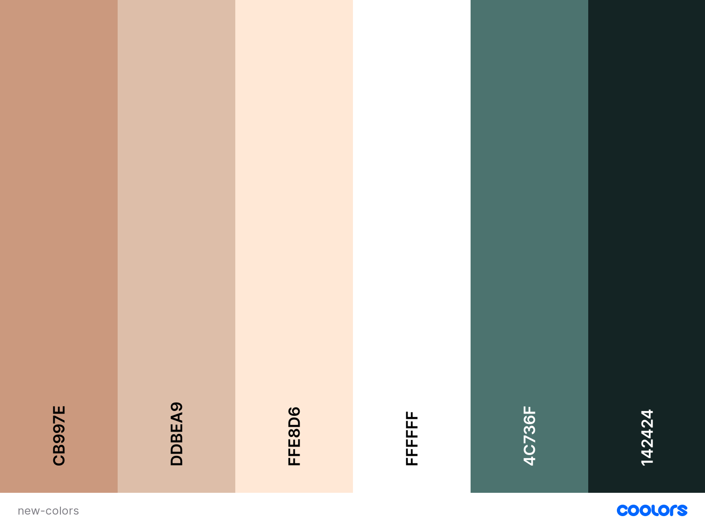

# Navigating Newcastle 

---

## Description

_this is a fictitious website created for my milestone project 3 with the code institute_.

An online website on "Geordie" dialect which is a rather well known accent widely recognised for being very distinct with many jargon/slang terms used instead of "proper" english. This website will allow users to view "Geordie Slang" and also add their own also with definitions of what each term means incase people ever visit Newcastle.

---

## Table of Contents

- [UX](#ux)
  - [Wireframes](#wireframes)
  - [Database](#database)
  - [User Stories](#user-stories)
    - [User](#user)
    - [Owner](#owner)
    - [Project Goals](#Goals-Derived-From-User-Stories)
---

## UX

### Wireframes

The initial wireframes for this project [Wireframes](https://github.com/Birrellc/Navigating-Newcastle/tree/master/static/wireframes)

---

### Database

- Terms Collection

| Key         | Value              | 
| ------------| -------------------|
| _id         | ObjectId           |
| word        | String             |
| definition  | String             |
| example     | String             |
| added_by    | String             |

- User Collection

| Key         | Value              | 
| ------------| -------------------|
| _id         | ObjectId           |
| username    | string             |
| password    | string             |

The database used for this project is MongoDB via Atlas Cloud.

The prcoess of this database for the 'user' to sign up to the website which will create a document in the User collection on MongoDB which contains their 'username' and a hashed version of their password for encryption. From their the website creates a 'user' key in session storage which is assigned to their username which then creates a unique profile page for that 'user'.
Once the 'user' reaches their profile page they can create a word. When the 'user' creates a word they will be asked to provide a word, definition and an example which will then be submitted to the dictionary collection in the database. To tie the 'user' to their created word their username will be attached to the word with the key added_by which will be available in the website dictionary for them and others to see but also gives the 'user' access to the specific words they create in order to edit and delete those words if they choose to.

| Signup / Login     |
| -------------------|
| Authenticate       |
| Create User        |


| Profile            |
|--------------------|
| Add Word           |
| Update Word        |
| Delete Word        |
| View Own Words     |


| Dictionary     |
| ---------------|
| Search Words   |
| View All Words |

---

### User Stories

#### User:

- As a user i would like to be able to navigate through the website quickly and clearly.
- As a user i would like to be able to see "Geordie Slang" terms & phrases.
- As a user i would like to be able to contact the owner of the website with any issues or suggestions.
- As a user i would like to be able to register and login seemlessly.
- As a user i would like to be able to create, edit/update and delete my own "Geordie Slang" terms and phrases.


#### Owner:

- As the owner of this website i would like to have my website useable on all platforms from mobile phones to desktop.
- As the owner of this website i would like users to be able to navigate through my website easily.
- As the owner of this website i would like to provide users with the ability to sign up and login with little effort.
- As the owner of this website i would like to users to be able to access all pages apart from the profile page without signing up.
- As the owner of this website i would like users to be able to add their own "Geordie Words" to the website and also edit and delete them.
- As the owner of this website i would like it to be made possible for the users to contact me via email.

#### Goals Derived From User Stories:

- The Goal of this website/project is to create a brief resource on the "Geordie Dialect" of Newcastle.
- The website will be aimed at people interested in the history or dialect of Newcastle and also people interested in visiting.
- This website will also provide a community spirit theme by allowing vistors or residents or former residents to add their own "Geordie Words" to the dictionary.

---

### Landing Page / Home

The landing page actually was originally designed to contain a main image as the background with a clip path slicing the page but as i got into the development of the project i felt for this specific website and its functions it would be best kept minimal so that the soul focus of the website could be viewed and reached with ease and no distraction. The landing page consists of a simple navbar(sidenav for mobile) and a card used as a jumbotron which contains the heading an image of newcastle and two buttons allowing the user to sign up or login to the website to access the dictionary. At the bottom of the page will be a footer used to display socials for proofing but also provide a contact email for the users to submit any issues( I originally aimed for a contact page but felt that for this project a simple button displayed on the footer of each page allowing for email would be more suited)

---

### Geordie Dictionary

Inside the main section will be collapsible fields displaying 'Geordie Dialect' words and phrases which can then be opened up when clicked to show definition, an example and who added the word or phrase to the page. Also at the top of the dictionary page is a search bar for the users to search for words specificially incase the list gets too big for users to identify specific works with ease. (admin user can update and delete all words on the dictionary page by the use of 2 buttons below each word only the admin can see)

---

### Profile

The profile page will consist of a heading that lists the users username at the top and also a button to add their own word to the dictionary, below this will be a dictionary of all the words the user themselves have added to the website which will be accompanied by 2 buttons, 1 for updating words incase of typo's and also a button to delete the word completely from the database/website.

---

### Login/Signup 

The login page & sign up pages are very similar so will be listed as one, these pages consist of forms created with WTforms which allow the users to login or signup to the website on completion of the form

---

### Error Pages 403, 404 & 500

There will be 3 very basic error pages for this website in order to help the user if anything does go wrong.
- 403: for any attempts access pages the user should not be able to (I actually have a login decorator that redirects users to a login page if they try hijack a url the 403 page is just there for future).
- 404: for any incorrect page url's.
- 500: for any internal service errors.

---

### Strategy Plane

The purpose of the website created is to be a modern focus on the well known 'Geordie Dialect' and also encouraging community by allowing users to submit content to the website.

- Design a simple to use "dictionary" where users can create, read, update and delete words.
- Design an easy to use website focusing on Newcastle and the Geordie Dialect.
- Design mobile responsive website.
- Provide a login system so users can create accounts and share data to the 'Geordie Dictionary'.

---

### Scope

- The website will provide a clean UX / UI for users to use effectively.
- The website will have full login functionality for users to create accounts
- The website will provide users the ability to interect with the Dictionary page and contribute to it when logged into their accounts
- The website will be an easy to use website focused on simplicity rather than more complicated design.
- All forms that require the input of user data must be validated for efficiency and professionalism.
- Allow Admin to Create, Read, Update and Delete user submitted content (CRUD).
- Allow user to Create, Read, Update and Delete their own content (CRUD).

---

### Structure

- The website is designed with ease of navigation in mind for each section allowing quick transition throughout the website and to avoid any distractions from the users originial purpose on the website.
- The website will also share the same design plan across all pages to keep things neat and easy for the user to use.
- Users without accounts or not logged in will only be able to see home, login and signup pages
- Users that are logged in will also 

---

### Skeleton

- Minimal Theme Navigation.  
- Pages - There will be a Home, Geordie Dictionary page, Login/Signup page and a Profile page and all pages will follow the same principles of design.
- Users - Users will have access to their own profile pages also.

---

### Surface

#### Color Scheme

- My color scheme came from the random color pannels generator on [Coolors](https://coolors.co/) later in the project i was unhappy with the original color scheme and chose to generate another random color scheme.



 - Nav, Footer & Collapsible Header.

 - Card Color.

 - Body Background & Sidenav Background Color.

 - Button Color.

 - Collapsible Body Color.

 - Sidenav Links, Font Awesome Icons And Links For Signup And Login Text.

#### Font

- The font used for this project is "[Comic Neue](https://fonts.google.com/specimen/Comic+Neue?preview.text_type=custom)" which i chose as i wanted a more casual font for this project instead of professional.

#### Images

- I chose only to use one image "[This image](https://github.com/Birrellc/Navigating-Newcastle/tree/master/static/images/nn-home.jpg)" for this project as it was based on a city so i felt i need to represent that city with atleast one image but i did not want to go overboard and distract from the main focus of the website which is the "Dictionary"

---

## Features

### Website Features

- 7 page website overall with add_word, update_word included.
- 3 User Interactive Forms With Validation.
- Account Registration & Login Features.
- Interactive dictionary application.
- CRUD options to create, read, update and delete words for all registered users.
- Search engine to allow users to search for specific words.
- Social media icons will be present on all pages.
- Error pages to help any users if there are any errors.
- Form validation for form security.
- Login decorators to help to stop URL hijacking of other users profile pages.


### Features to be Implemented in the Future

- Google reCAPTCHA.
- Fully functioning checkout system to add to the shopping cart for successful online orders.
- Upvote system for popular words.
- a-z search order
- Newsletter system with to send users which words have been added that month.
- Password reset emails

---

## Security

- URL hijacking security is handled by a [Login Decorator](https://flask.palletsprojects.com/en/1.1.x/patterns/viewdecorators/). With this feature I am able to force users whos session cookie does not match the user's profile to be redirected to the login page instead of to the other user's page.

- Form Validation from [WTForms](https://pypi.org/project/WTForms/) is also in place to help with basic form security by prevention of using an initial white space and also validating data correctly to help ensure the information submited is correct.

- Password Hashing is used when the user signs up to the website through [Werkzueg](https://pypi.org/project/Werkzeug/) where a user's password is encoded to a hashkey that also contains a random series of salt characters to add extra protection to the user's password.

---

## Technologies

### Languages

- [HTML5](https://en.wikipedia.org/wiki/HTML5)
- [CSS3](https://en.wikipedia.org/wiki/CSS)
- [Javascript](https://en.wikipedia.org/wiki/JavaScript)
- [Python](https://en.wikipedia.org/wiki/Python_(programming_language))


### Frameworks

- [Materialize](https://materializecss.com/)
- [jQuery](https://jquery.com/)
- [Flask](https://flask.palletsprojects.com/en/1.1.x/)


### Workspace

- [VSCode](https://code.visualstudio.com/)
- [Gitpod](https://www.gitpod.io/)
- [Git](https://git-scm.com/)
- [GitHub](https://github.com/)

### External Resources

- [Google Fonts](https://fonts.google.com/) - Used to import fonts for the website.
- [W3C HTML Validator](https://validator.w3.org/) - Used to test/validate HTML code on the website.
- [W3C CSS Validator](https://jigsaw.w3.org/css-validator/) - Used to test/validate the CSS code on the website.
- [Pexels](https://https://www.pexels.com/) - Stock image resource.
- [Tinypng](http://https://tinypng.com/) - Website used to compress my images to allow for faster loading times.
- [Font Awesome](https://fontawesome.com/) - Used to provide small icons for the website. eg. Testimonial quotes section.
- [Stack Overflow](https://fonts.google.com/) - Resource which provided the 3 fonts: Anton, Arvo & Montserrat for the website.
- [Google PageSpeed Insights](https://developers.google.com/speed/pagespeed/insights/) - Used to test the loading speed of the website.
- [Responsivley App](https://responsively.app/) - Used to test responsive web apps.
- [Real Favicon Generator](https://realfavicongenerator.net/) - Used to create my favicon image and also test to see if it was working.
- [Spell Checker for Chrome](https://chrome.google.com/webstore/detail/spell-checker-for-chrome/jfpdnkkdgghlpdgldicfgnnnkhdfhocg?hl=en) - Used to spell check my **README.md** & **testing.md**.
- [W3 Schools](https://www.w3schools.com/) - Used as a general resource to help with coding.
- [Am I Responsive](http://ami.responsivedesign.is/) - Used to create mockup of responsive website for **README.md**.
- [Youtube](https://www.w3schools.com/) - Used as a general resource for help with code.
- [Balsamiq](https://balsamiq.com/wireframes/) - Used to create wireframes.
- [Markdown Cheat Sheet](https://github.com/adam-p/markdown-here/wiki/Markdown-Cheatsheet) - Used to create my **README.md** & **Testing.md** files.
- [Grammarly(unofficial)](https://marketplace.visualstudio.com/items?itemName=znck.grammarly) - A plugin for VSCode which I used to check the grammar and spelling for my README.md & testing.md docs.
- [BrowserStack](https://www.browserstack.com) - Used to test my website with the Safari browser.
- [Lighthouse](https://developers.google.com/web/tools/lighthouse) - Used to check accessabilty and SEO scores for the website.
- [Code Institute](https://codeinstitute.net/) - Main source of coding knowledge and project was heavily based of their course material.
- Code institute Slack Community - Used for inspiration for my website.

### Dependencies

- [Pymongo](https://pypi.org/project/pymongo/https://codeinstitute.net/) and [Pymongo](https://flask-pymongo.readthedocs.io/en/latest/) which i used to connect my project to my MongoDB database.
- [click](https://pypi.org/project/click/) which is a command line interface toolkit.
- [dnspython](https://pypi.org/project/dnspython/) which is a dns toolkit for Python.
- [itsdangerous](https://pypi.org/project/itsdangerous/) which provides various helpers to pass data to untrusted environments and return it safely.
- [Jinja2](https://pypi.org/project/Jinja2/) which is a templating language for Python
- [WTForms](https://pypi.org/project/WTForms/) which is a flexible forms validation and rendering library for Python
- [Werkzueg](https://pypi.org/project/Werkzeug/) which is used in this project to provide security by hashing user passwords

---

## Testing

Testing has is logged in its own document 

---

## Deployment

This project contains mongodb for storage and is deployed on https://www.heroku.com/

### Prerequisites

In order to deploy the application please ensure that the requirements below are met and installed:

[Python3](https://www.python.org/downloads/)
[Pip](https://pypi.org/project/pip/)
[Git](https://git-scm.com/downloads)
[Heroku CLI](https://devcenter.heroku.com/articles/heroku-cli)

### Cloning from GitHub

- Head over to the repository location here(insert link later)
- Click the 'code' button and download the zip file from the repository or alternatively you can clone the repository by using the following url in your terminal with the commands:

``` git clone https:/github.com/BirrellC/navigating-newcastle.git ```

### IDE

- Open the application in your IDE.
- In your IDE terminal with the Application folder open type
``` python -m pip -r requirements.txt ```
- This will install the required modules for the application

### MongoDB

- Head over to your MongoDB account and create a new project called "navigating newcastle"
- From there create two collections "dictionary" and "user" which contain the keys listed in the database section above
- Next create a file in the project called "env.py" with the following code:

```
import os

os.environ.setdefault("IP", "0.0.0.0")
os.environ.setdefault("PORT", "5000")
os.environ.setdefault("SECRET_KEY", "YOUR_SECRET_KEY") #Create a random secret key for your project
os.environ.setdefault("MONGO_URI", "YOUR_MONGO_URI")
os.environ.setdefault("MONGO_DBNAME", "navigating_newcastle") #which is the database name that you created in mongodb
```

- Next return to MongoDB and click connect on your database, from there click connect your application and copy and paste the link and replace "YOUR_MONGO_URI" in your env.py file.
- Replace the password with your password for your MongoDB database and the database name.

### Heroku

- First ensure a "Procfile" is created and your requirements.txt is up to date, do this by using the following commands:
``` pip3 freeze --local > requirements.txt ```
``` echo web: python app.py > Procfile ```
- Next login to your Heroku account and create a new app.
- Make sure you have a GitHub Repository for this project.
- You can then add Heroku to your GitHub Repository by heading to your settings then pasting the URL in your terminal for example:

``` git remote add heroku https://git.heroku.com/your-heroku-git-url-here ```

- You can then push to heroku with the following command in your terminal:

``` git push heroku master ```

- Once you are ready to prepare the application for deployment and launch use the command:

``` heroku ps:scale web=5 ```

- Alternatively you can connect your Heroku app to your GitHub repository for the project by clicking the connect to GitHub as your deployment method in your Heroku deploy settings.
- Next head over to reveal cvars in your Heroku settings and create the key value pairs for:


| Key            | Value                      | 
| ---------------|----------------------------|
| IP             | 0.0.0.0                    |
| PORT           | 5000                       |
| SECRET KEY     | YOUR SECRET KEY HERE       |
| MONGO_URI      | YOUR MONGO URI STRING HERE |
| MONGO_DBNAME   | YOUR DB NAME HERE          |

- Next head over to Heroku deploy section and click "Deploy Now" in the manual section and after that you can also enable automatic deploy also.
- The project should now be deployed to Heroku and can be accessed by clicking "Open App".

---

## Credits

- First Credits go to my mentor [Felipe Alarcon](https://github.com/fandressouza) for guidance and advice on how to get this project ready for submission and also for the emphasis on security.
- Code institute for providing the content and support to help learn and develop my skills.
- Code Institute slack community members for all the contributions they make to the platform.
- [Michael Herman - Youtube](https://www.youtube.com/watch?v=WCpNvteLCDI) - For ideas to use login decorators.
- [Corey Schafer - Youtube](https://www.youtube.com/watch?v=MwZwr5Tvyxo&list=PL-osiE80TeTs4UjLw5MM6OjgkjFeUxCYH) - The Flask course on this Youtube Channel helped greatly with my project overall
- [Login Decorators](https://flask.palletsprojects.com/en/1.1.x/patterns/viewdecorators/) - The code was taken from the documentation after getting the idea from the link above.
- [WTForms](https://wtforms.readthedocs.io/en/2.3.x/) & [100 days of Python Code](https://www.udemy.com/course/100-days-of-code/learn/lecture/22372310?start=0#notes)  - Without the documentation resource and one of the lessons in this course I wouldn't have been able to set up the forums the way I would have wanted.
- [Code Institute](https://codeinstitute.net/) - Alot of this project comes from the course material provided by Code Institute.
- [Markdown Colors](https://stackoverflow.com/questions/11509830/how-to-add-color-to-githubs-readme-md-file/41247934#41247934) - Thanks to this post i was able to add color to my Readme.md file.
- [StackOverflow](https://stackoverflow.com/questions/22084886/add-a-css-class-to-a-field-in-wtform) - For help with adding classes to WTforms
- [Flask Cheat Sheet](https://s3.us-east-2.amazonaws.com/prettyprinted/flask_cheatsheet.pdf) - I found this helpful when going through my project when i forgot how to correctly structure routes and other Flask elements

### Media

- The only image for this project were taken from [Pexels](https://https://www.pexels.com/)


 