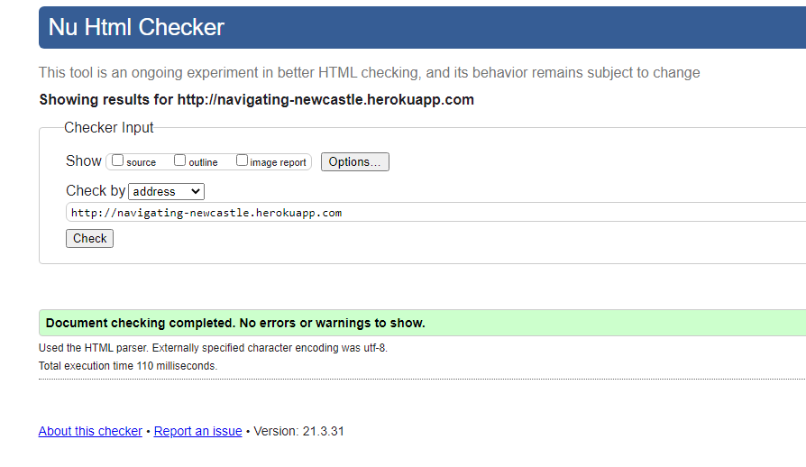
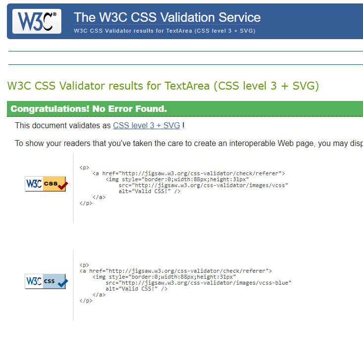
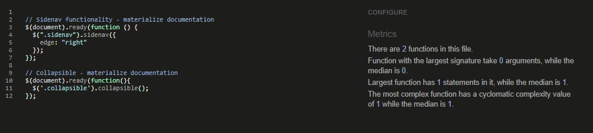
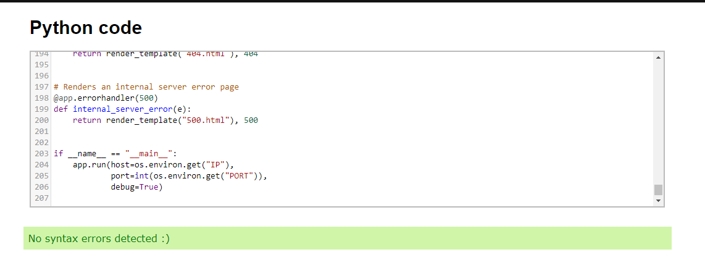
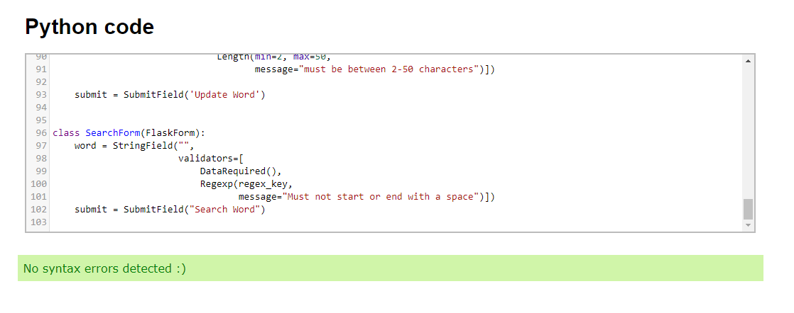
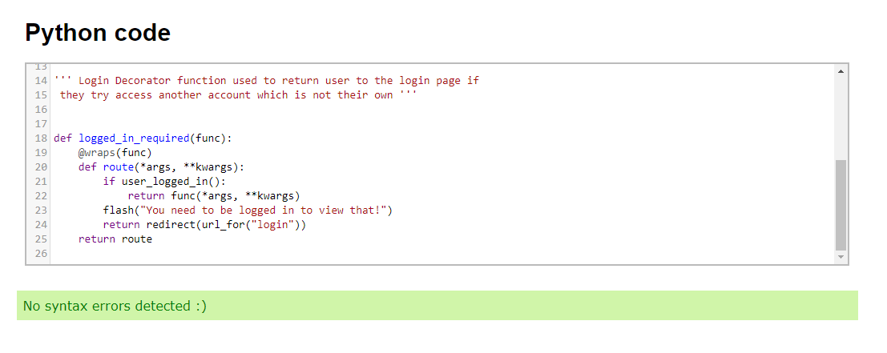
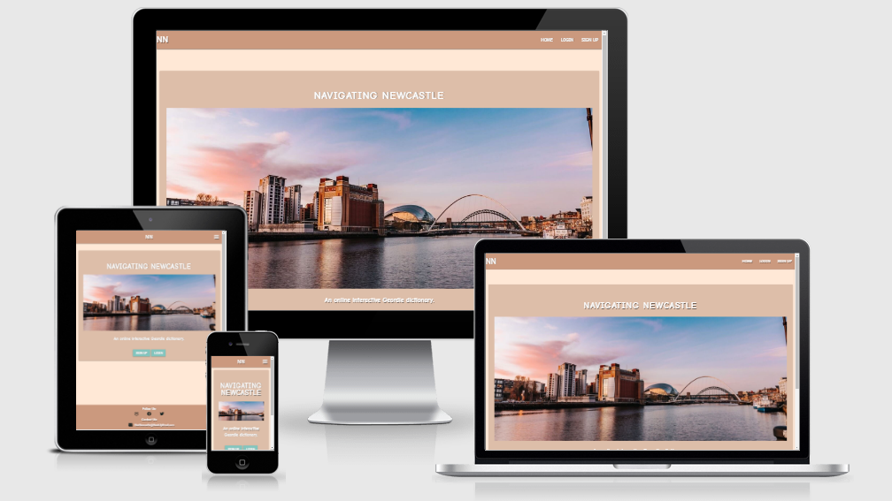
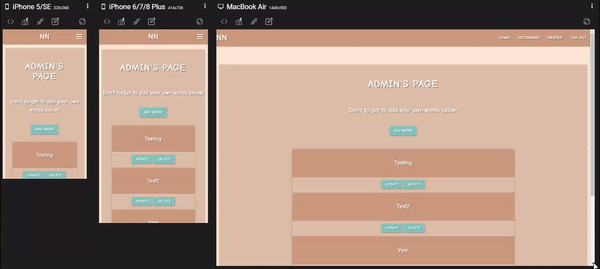

# TESTING

This project has been tested throughout with the use of preview, DevTools, manual testing and also the website was deployed on Heroku pages very early in development with an automatic deploy feature enabled for every commit made which allowed me to test live deployments very early in the development cycle.

---

## USER STORY TESTING

### User Story #1

- **As a user i would like to be able to navigate through the website quickly and clearly.**

#### Logged Out

#### Logged In

#### Mobile View

- The user will be able to easily navigate through the website with the links and shown in the clips above.
- To do this the user just needs to look towards to navigation links in the top right for desktop version and click the hamburger icon to pull out the sidenav in the mobile version.

### User Story #2

- **As a user i would like to be able to see "Geordie Slang" words**

#### After Logging In / Signing Up:

- The user will be able to see the words/terms on the website by first navigating to signup if they do not yet have an account, if they do then they must proceed to login.
- Next the user should go to the Navigation bar and click on Dictionary to be taken to the page where all words in the dictionary will be displayed in collapsible fields that the user can click on and see the definition of the word plus an example.

### User Story #3

- **As a user i would like to be able to contact the owner of the website with any issues or suggestions.**

- The user will be able to contact the site owner by clicking on either the mail icon or email address in the footer displayed sitewide.
- The user could also copy and paste the email into their email if they preferred.
- I chose not to create a dedicated contact page for this project due to it being more Python CRUD focused and also felt a dictionary application doesn't really need a dedicated contact page.

### User Story #4

- **As a user i would like to be able to register and login seemlessly.**

#### Sign Up

#### Login

- The user can Login or Register to the website as easy as show in the videos above.
- The user must navigate to either the Sign Up page or the Login Page depending if they have an account or not.
- The Validation for Creating an account is as follows:

1. Username must be between 3 and 12 characters long.
2. Username's cannot start or end with a 'space'.
3. Passwords must be over 8 characters.

(I play to make this more secure in the future)

### User Story #5

- **As a user i would like to be able to create, edit/update and delete my own "Geordie Slang" terms and phrases.**

#### Create

- For creating a word:

1. Login to your account or signup if you do not have one.
2. Navigate to your profile page.
3. Click on the 'Add Word' button.
4. Fill out the form.
5. Submit your word.

- After completing the above your word should now be in the dictionary.

#### Update

- For Updating a word:

1. Login to your account or Signup if you do not have one.
2. Navigate to your profile page.
3. Create a word by using the procedure above if you do not have one already created.
4. Click the 'Update' button.
5. Fill out the form.
6. Submit your updated word.

- After completing this click on your word in either the dictionary or on your profile page to see your updated word.

#### Delete

- For Deleting a word:

1. Login to your account or Signup if you do not have one.
2. Navigate to your profile page.
3. Create a word by using the procedure for adding a word shown above if you do not have one already created.
4. Locate the word you want to delete on your profile page.
5. Click the 'Delete' Button.

- After completing this your word will be removed from your profile page and the website dictionary.

### User Story #6

- **As a user i would like to be able to search the dictionary for specific words incase the dictionary grows to a large size so i can find a word faster.**

- For Searching a word:

1. Login to your account or Signup if you do not have one.
2. Navigate to the dictionary page.
3. Type the word you want to find in the search box.
4. Click search to find your word.
5. Click Reset to reset the dictionary.

---

## HTML

- For HTML testing I ran my code through [W3C HTML Validator](https://validator.w3.org) by URI validation using my [Deployed Live Site](https://validator.w3.org).
- I received no errors for my HTML as shown in the Image below.
- In order to be extra thorough i actually tested the link for each page although the image only shows the main site test everything came back with 0 errors.

---

## CSS

- For CSS testing i first [Auto Prefixer CSS](https://autoprefixer.github.io) to make sure my CSS has all the correct vendor prefixes.
- The commit showing these changes being implemented can be found [Here](https://github.com/Birrellc/Navigating-Newcastle/commit/fc256d091fc00856bba4dce0a80f9b0ad88e076a)
- I then proceeded to run my code through [W3C CSS Validator](https://jigsaw.w3.org/css-validator/) and received no errors as shown in the image below.
- I also then applied a red border to all my elements to check for any overflow issues & there are none.

---

## jQuery / JavaScript

- Due to my project being more focused on creating a CRUD application I found I did not need to use as much JavaScript for this process to chose to keep it to a minimum to allow more time to focus on the core concepts of the project.
- For JavaScript validation I ran my code through [JsHint](https://jshint.com/) and recieved no errors or warnings as show in the image below.

---

## Python

- For Python testing I ran my code through [Extends Class Python Tester](https://extendsclass.com/python-tester.html).
- I ran through all 3 of my .py files: app.py, forms.py and decorators.py of which i recieved no errors for any of them as show below.

#### app.py

#### forms.py

#### decorators.py

---

## Responsive Testing

- I used 3 different methods for my responsive testing which were: [DevTools](https://developer.chrome.com/docs/devtools/), [Am I Responsive](http://ami.responsivedesign.is/) & [Responsivley App](https://responsively.app/)
- First off throughout the project i used [DevTools](https://developer.chrome.com/docs/devtools/) to keep an eye out for any responsive errors and continued throughout the whole development process.
- Nearing to the end of the process i used [Am I Responsive](http://ami.responsivedesign.is/) to create the snapshot below showing how the project looks on various devices.

#### Am I Responsive

- After using Am i Responsive i decided to use [Responsivley App](https://responsively.app/) to view my website with multiple device sizes at once where i noticed an issue where there was a spacing below my footer when using that app but when i looked at the same resolutions in devtools i found no spacing so decided to leave it here. Example shown below

#### Responsively

Full list of tested resolutions with [DevTools](https://developer.chrome.com/docs/devtools/) & [Responsivley App](https://responsively.app/):

1. iPhone 5/5se 320px
2. iPhone X 375px
3. Pixel 2 411px
4. iPhone 6/7/8 Plus 414px
5. Ipad 768px
6. Nexus 10 800px
7. Generic Laptop 1280px
8. MacBook Air 1440px
9. Desktop 1920px

---
