# TESTING

This project has been tested throughout with the use of preview, DevTools, manual testing and also the website was deployed on Heroku pages very early in development with an automatic deploy feature enabled for every commit made which allowed me to test live deployments very early in the development cycle.

---

## USER STORY TESTING

### User Story #1

- **As a user i would like to be able to navigate through the website quickly and clearly.**

#### Logged Out

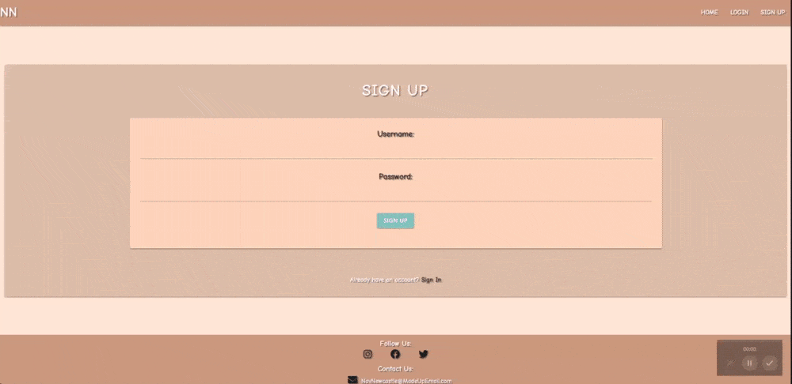

#### Logged In

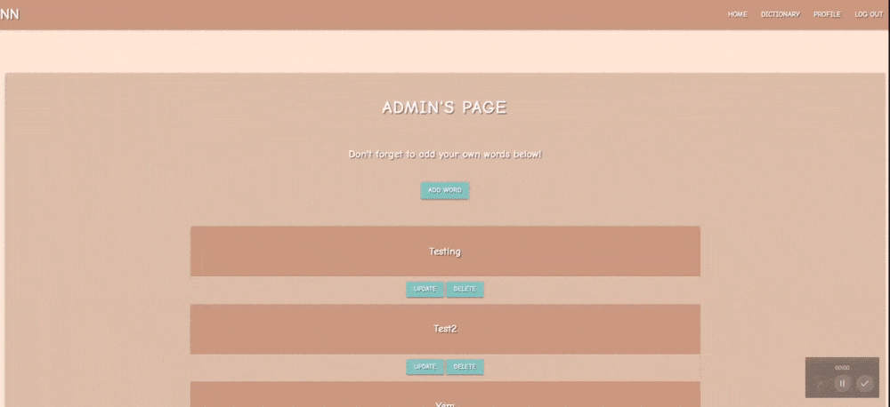

#### Mobile View

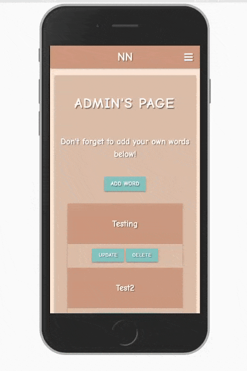

- The user will be able to easily navigate through the website with the links and shown in the clips above.
- To do this the user just needs to look towards to navigation links in the top right for desktop version and click the hamburger icon to pull out the sidenav in the mobile version.

### User Story #2

- **As a user i would like to be able to see "Geordie Slang" words**

#### After Logging In / Signing Up:

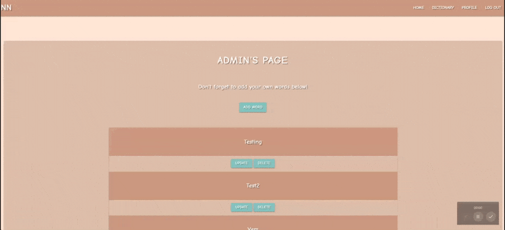

- The user will be able to see the words/terms on the website by first navigating to signup if they do not yet have an account, if they do then they must proceed to login.
- Next the user should go to the Navigation bar and click on Dictionary to be taken to the page where all words in the dictionary will be displayed in collapsible fields that the user can click on and see the definition of the word plus an example.

### User Story #3

- **As a user i would like to be able to contact the owner of the website with any issues or suggestions.**

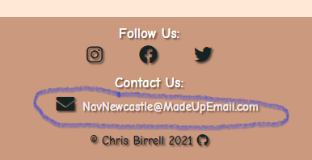

- The user will be able to contact the site owner by clicking on either the mail icon or email address in the footer displayed sitewide.
- The user could also copy and paste the email into their email if they preferred.
- I chose not to create a dedicated contact page for this project due to it being more Python CRUD focused and also felt a dictionary application doesn't really need a dedicated contact page.

### User Story #4

- **As a user i would like to be able to register and login seemlessly.**

#### Sign Up

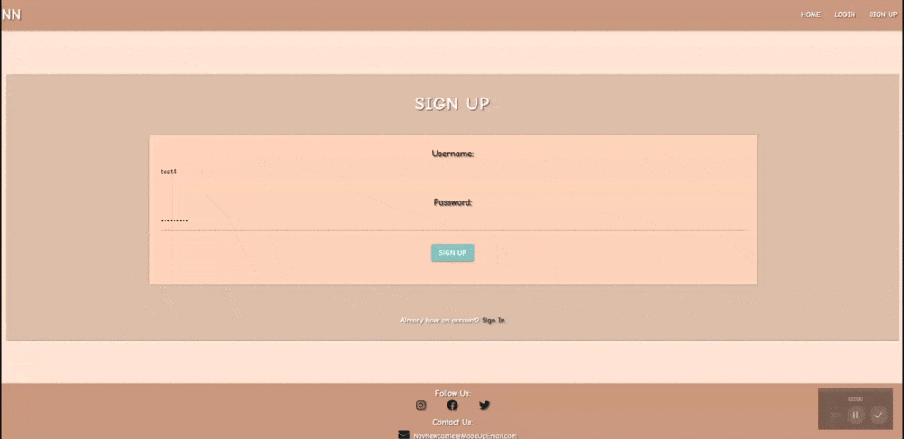

#### Login

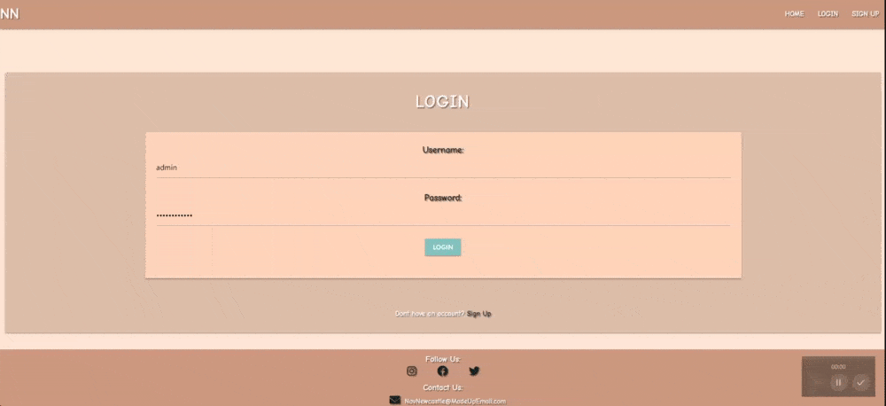

- The user can Login or Register to the website as easy as show in the videos above.
- The user must navigate to either the Sign Up page or the Login Page depending if they have an account or not.
- The Validation for Creating an account is as follows:

1. Username must be between 3 and 12 characters long.
2. Username's cannot start or end with a 'space'.
3. Passwords must be over 8 characters.

(I play to make this more secure in the future)

### User Story #5

- **As a user i would like to be able to create, edit/update and delete my own "Geordie Slang" terms and phrases.**

#### Create

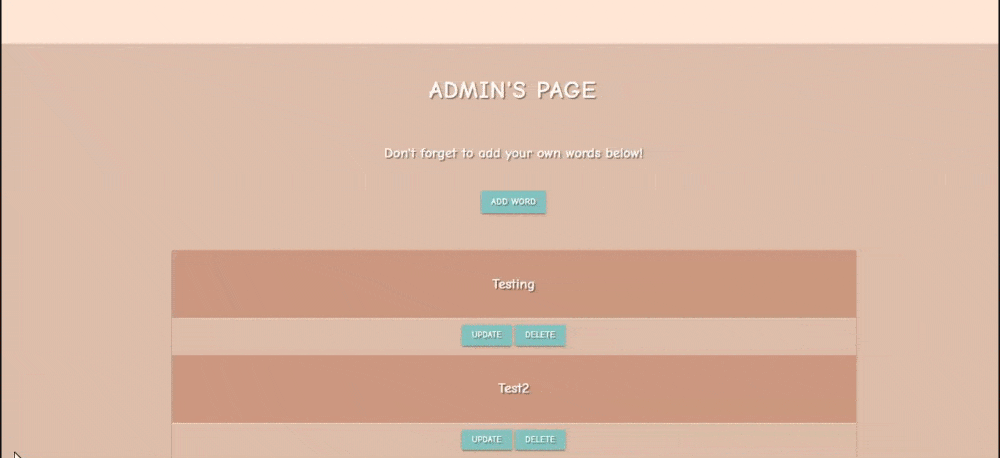

- For creating a word:

1. Login to your account or signup if you do not have one.
2. Navigate to your profile page.
3. Click on the 'Add Word' button.
4. Fill out the form.
5. Submit your word.

- After completing the above your word should now be in the dictionary.

#### Update

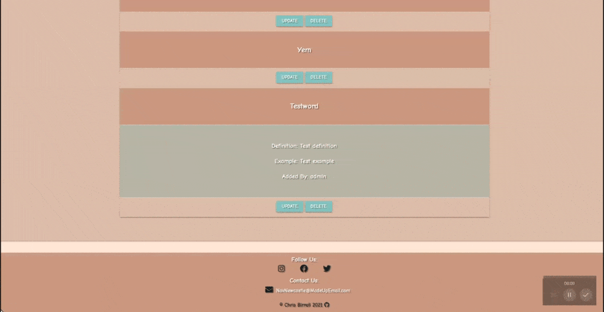

- For Updating a word:

1. Login to your account or Signup if you do not have one.
2. Navigate to your profile page.
3. Create a word by using the procedure above if you do not have one already created.
4. Click the 'Update' button.
5. Fill out the form.
6. Submit your updated word.

- After completing this click on your word in either the dictionary or on your profile page to see your updated word.

#### Delete

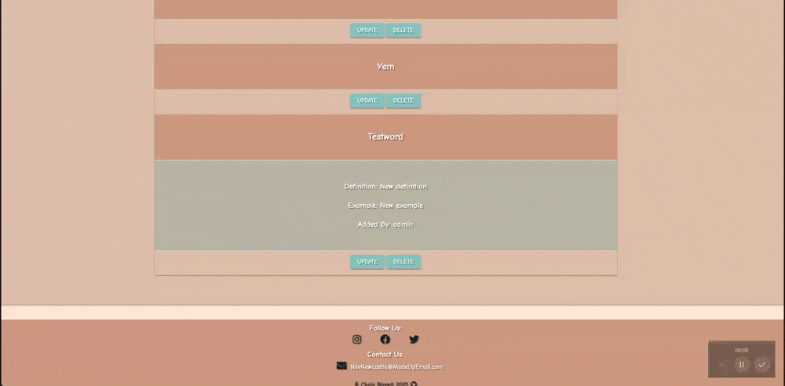

- For Deleting a word:

1. Login to your account or Signup if you do not have one.
2. Navigate to your profile page.
3. Create a word by using the procedure for adding a word shown above if you do not have one already created.
4. Locate the word you want to delete on your profile page.
5. Click the 'Delete' Button.

- After completing this your word will be removed from your profile page and the website dictionary.

### User Story #6

- **As a user i would like to be able to search the dictionary for specific words incase the dictionary grows to a large size so i can find a word faster.**

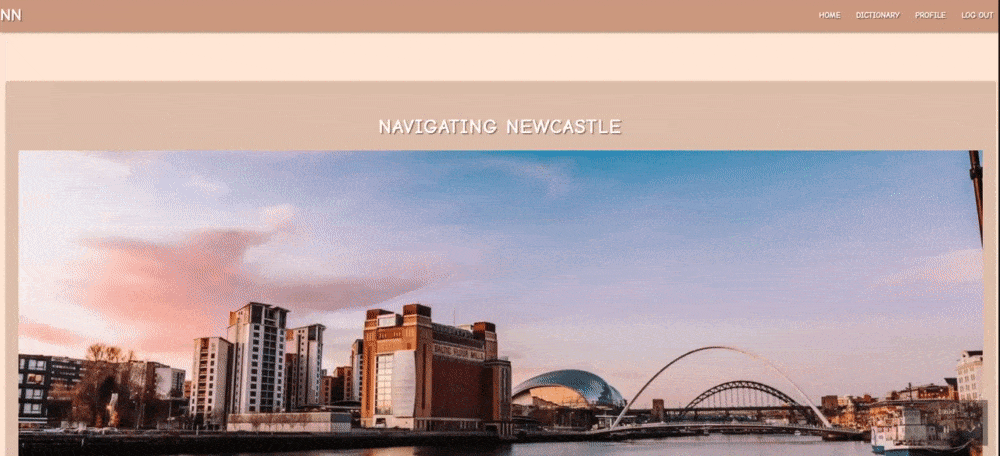

- For Searching a word:

1. Login to your account or Signup if you do not have one.
2. Navigate to the dictionary page.
3. Type the word you want to find in the search box.
4. Click search to find your word.
5. Click Reset to reset the dictionary.

---

## HTML

- For HTML testing I ran my code through [W3C HTML Validator](https://validator.w3.org) by URI validation using my [Deployed Live Site](https://validator.w3.org).
- I received no errors for my HTML as shown in the Image below.
- In order to be extra thorough i actually tested the link for each page although the image only shows the main site test everything came back with 0 errors.

---

## CSS

- For CSS testing i first [Auto Prefixer CSS](https://autoprefixer.github.io) to make sure my CSS has all the correct vendor prefixes.
- The commit showing these changes being implemented can be found [Here](https://github.com/Birrellc/Navigating-Newcastle/commit/fc256d091fc00856bba4dce0a80f9b0ad88e076a)
- I then proceeded to run my code through [W3C CSS Validator](https://jigsaw.w3.org/css-validator/) and received no errors as shown in the image below.
- I also then applied a red border to all my elements to check for any overflow issues & there are none.

---

## jQuery / JavaScript

- Due to my project being more focused on creating a CRUD application I found I did not need to use as much JavaScript for this process to chose to keep it to a minimum to allow more time to focus on the core concepts of the project.
- For JavaScript validation I ran my code through [JsHint](https://jshint.com/) and recieved no errors or warnings as show in the image below.

---

## Python

- For Python testing I ran my code through [Extends Class Python Tester](https://extendsclass.com/python-tester.html).
- I ran through all 3 of my .py files: app.py, forms.py and decorators.py of which i recieved no errors for any of them as show below.

#### app.py

#### forms.py

#### decorators.py

---

## Responsive Testing

- I used 3 different methods for my responsive testing which were: [DevTools](https://developer.chrome.com/docs/devtools/), [Am I Responsive](http://ami.responsivedesign.is/) & [Responsivley App](https://responsively.app/)
- First off throughout the project i used [DevTools](https://developer.chrome.com/docs/devtools/) to keep an eye out for any responsive errors and continued throughout the whole development process.
- Nearing to the end of the process i used [Am I Responsive](http://ami.responsivedesign.is/) to create the snapshot below showing how the project looks on various devices.

#### Am I Responsive

- After using Am i Responsive i decided to use [Responsivley App](https://responsively.app/) to view my website with multiple device sizes at once where i noticed an issue where there was a spacing below my footer when using that app but when i looked at the same resolutions in devtools i found no spacing so decided to leave it here. Example shown below

#### Responsively

Full list of tested resolutions with [DevTools](https://developer.chrome.com/docs/devtools/) & [Responsivley App](https://responsively.app/):

1. iPhone 5/5se 320px
2. iPhone X 375px
3. Pixel 2 411px
4. iPhone 6/7/8 Plus 414px
5. Ipad 768px
6. Nexus 10 800px
7. Generic Laptop 1280px
8. MacBook Air 1440px
9. Desktop 1920px

---

## Manual Testing

Throughout this project i tested things manually via a preview environment and also on the live heroku hosted website due to having deployed early in the process.

All testing below is done on both the deployed live website and also the live preview.

### Nav

- Main

Clicked 'NN' (brand name) which successfully took me back to the Home Page.
Clicked the Hamburger icon in the top right which successfully opened the sidenav on mobile devices.

- Before logging in:

Clicked 'Home' which successfully took me back to Home Page.
Clicked 'Sign Up' which successfully took me back to the Signup Page.
Clicked 'Login' which successfully took me back to Login Page.

- After Logging in:

Clicked 'Home' which successfully took me back to Homepage.
Clicked 'Profile' Which successfully took me to my own Profile Page.
Clicked 'Dictionary' Which successfully took me to the Dictionary Page.
Clicked 'Log Out' which successfully logged me out and took me to the Login Page.

- While testing these features in mobile view i found that the link area's around the actual links would sometimes open the wrong link when clicked i fixed this by switching my display to flex and removing the padding-top style i was using on the elements which can be found in the commit [HERE](https://github.com/Birrellc/Navigating-Newcastle/commit/0221fde9590b9fde4068ee67917e6caf43451cb5)

### Footer

- Socials

Clicked the 'Facebook' icon which successfully opened Facebook.
Clicked the 'Instagram' icon which successfully opened Instagram.
Clicked the 'Twitter' icon which successfully opened Twitter.

- Mail

Clicked the 'Mail' icon which successfully opened Mail on my PC.
Clicked the 'Email' icon which successfully opened Mail on my PC.

- Copyright

Clicked the 'GitHub' icon which successfully loaded my GitHub profile page.
Clicked my 'name' which successfully loaded my GitHub profile page.

### Home (index.html)

Clicked 'Login' Button which successfully opened the Login Page.
Clicked 'Sign Up' Button which successfully opened the Sign Up Page.

### Sign Up (signup.html)

- Basic Sign Up Functionality:

Entered 'Test05' as username and 'password' as password then clicked Sign Up Button and the account was successfully created with the correct message displayed on the profile page also.

- Validation Rules

1. Username must be between 3-12 characters.
2. Username must not start or end with Whitespace.
3. Username Data is required.
4. Password must be 8 characters minimum.
5. Password must not start or end with Whitespace.
6. Password Data is required.
7. Username is not case sensitive for example testuser is the same as TESTUSER or TestUser.
8. Username cannot already exist.

- Validation Test:

1. Tried to sign up as Test05 again and the signup failed with the correct error message.
2. Tried to sign up as TEST05 again and the signup failed with the correct error message.
3. Tried to sign up as TE and the signup failed with the correct error message.
4. Tried to sign up as test12345678912345 and the signup failed with the correct error message.
5. Tried to sign up as test06 but with a whitespace at the start and the signup failed with the correct error message.
6. Tried to sign up as test06 but with a whitespace at the end and the signup failed with the correct error message.
7. Tried to sign up as test06 with the password 'pass' and the signup failed again with the correct error message.
8. Tried to sign up as test06 with the password 'password' but with a whitepace at the start signup failed again with the correct error message after changes.
9. Tried to sign up as test06 with the password 'password' but with a whitespace at the end signup failed again with the correct error message after changes.
10. Tried to sign up with no username and was unable to.
11. Tried to sign up with no password and was unable to.

- Validation Test Notes:

Tests 8 & 9 failed originally but i corrected the code and then retested and they both passed the tests you can find the commit of the change [HERE](https://github.com/Birrellc/Navigating-Newcastle/commit/335e5cbc2f3283f3793123284f91c29050b090bd)

- Link:

Clicked the link at the end of 'Already have an account? Login' and was successfully redirected to the Login Page.

### Login (login.html)

- Basic Login Functionality:

Entered 'Test05' as username and 'password' as password then clicked Login button and was successfully logged in a taken to 'Test05' Profile Page.

- Validation Rules

1. Username must be between 3-12 characters.
2. Username must not start or end with Whitespace.
3. Username Data is required.
4. Password must be 8 characters minimum.
5. Password must not start or end with Whitespace.
6. Password Data is required.
7. Username is not case sensitive for example testuser is the same as TESTUSER or TestUser.

- Validation Test:

1. Tried to login as Test05 with an incorrect password and login failed with the correct error message.
2. Tried to login as TEST05 and the login was successful as Login is not case sensitive.
3. Tried to login as Test20 which doesnt exist and login failed with tthe correct error message
4. Tried to login as Test05 with the correct password apart from a whitespace at the end and the login failed with the correct error message.
5. Tried to login as Test05 with the correct password apart from a whitespace at the start and the login failed with the correct error message.
6. Tried to login with no username and was unable to.
7. Tried to login with no password and was unable to.

- Link:

Clicked the link at the end of 'Dont have an account? Sign Up' and was successfully redirected to the Sign Up Page.

### Add Word (add_word.html)

- Base Add Word Functionality Test:

Typed 'test' in the word field, typed 'test definition' in the definition field, typed 'test example' in the example field then i clicked the 'Add Word' button and the word was added to the dictionary and my profile page successfully.

- Validation Rules

1. Word must be between 2-15 characters.
2. Word must not start or end with Whitespace.
3. Word Data is required.
4. Definition must be between 2-25 characters.
5. Definition must not start or end with Whitespace.
6. Definition Data is required.
7. Example must be between 2-50 characters.
8. Example must not start or end with Whitespace.
9. Example Data is required.
10. Words cannot be added if theyre already in the dictionary/database.

- Validation Test

1. Tried to create the word 'test' again which failed due to already being in the dictionary and displayed the correct error message.
2. Tried to create a new word with no definition and was unable to.
3. Tried to create a word with no actual word and was unable to.
4. Tried to create a word with no example and was unable to.
5. Tried to create a 1 letter word which failed with the correct error message.
6. Tried to create a 16 letter word which failed with the correct error message.
7. Tried to create a 1 letter definition which failed with the correct error message.
8. Tried to create a 26 letter definition which failed with the correct error message.
9. Tried to create a 1 letter example which failed with the correct error message.
10. Tried to create a 51 letter example which failed with the correct error message.
11. Tried to create a word starting with a white space which failed wit the correct message.
12. Tried to create a word ending with a white space which failed wit the correct message.
13. Tried to create a definition starting with a white space which failed wit the correct message.
14. Tried to create a definition ending with a white space which failed wit the correct message.
15. Tried to create an example starting with a white space which failed wit the correct message.
16. Tried to create an example ending with a white space which failed wit the correct message.

### Update Word (update_word.html)

- Base Update Word Functionality Test:

Using steps 1 & 2 and clicking the update button I was able to update the definition and example for the word 'test'.

- Validation Rules

1. Word must be between 2-15 characters.
2. Word must not start or end with Whitespace.
3. Word Data is required.
4. Definition must be between 2-25 characters.
5. Definition must not start or end with Whitespace.
6. Definition Data is required.
7. Example must be between 2-50 characters.
8. Example must not start or end with Whitespace.
9. Example Data is required.

- Validation Test

1. Tried to update 'test' word definition to 'update definition test' which was successful.
2. Tried to update 'test' word example to 'update example test' which was successful.
3. Tried to update 'test word to 'test1' which was successful.
4. Tried to update a word with no example and was unable to.
5. Tried to update a 1 letter word which failed with the correct error message.
6. Tried to update a 16 letter word which failed with the correct error message.
7. Tried to update a 1 letter definition which failed with the correct error message.
8. Tried to update a 26 letter definition which failed with the correct error message.
9. Tried to update a 1 letter example which failed with the correct error message.
10. Tried to update a 51 letter example which failed with the correct error message.
11. Tried to update a word starting with a white space which failed wit the correct message.
12. Tried to update a word ending with a white space which failed wit the correct message.
13. Tried to update a definition starting with a white space which failed wit the correct message.
14. Tried to update a definition ending with a white space which failed wit the correct message.
15. Tried to update an example starting with a white space which failed wit the correct message.
16. Tried to update an example ending with a white space which failed wit the correct message.

- Validation Notes

*** BUG FOUND *** - while doing my tests for update_word.html I found that if I update my own word for example 'test' to 'test1' test will be replaced and no longer exist but if another user created test1 before i updated test to test1 there would then be 2 test1's in the dictionary.
